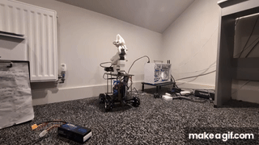
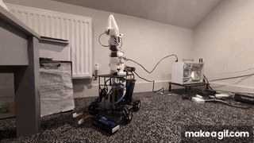

# OmniBot — Low-Cost Mobile Manipulation with SmolVLA

> **A $500 mobile manipulation robot** that learns pick-and-place tasks from ~50 human demonstrations.
> Mecanum base + SO-101 arm + 6-camera array controlled by a single learned policy. Fully open-source.




<p align="center">
  <a href="../../wiki/Bill-of-Materials"></a>
  
  
  
</p>

---

## Why OmniBot?

| | OmniBot | Mobile ALOHA | Hello Stretch |
|--|--|--|--|
| **Cost** | **~$500** | ~$32,000 | ~$25,000 |
| **Base type** | **Holonomic (mecanum)** | Differential | Differential |
| **Policy** | SmolVLA (unified) | ACT | Various |
| **Cameras** | **6 (BEV array + depth + wrist)** | 3 | 2 |
| **Open-source** | Yes | Yes | Yes |

**Three things that make it different:**

- **Holonomic base** — strafes, rotates in place, moves diagonally without repositioning. Differential drive robots can't do this.
- **Unified 9D policy** — SmolVLA controls the arm (6 joints) and base (vx, vy, vz) as a single output vector. One model, one action space, one training run.
- **6-camera array** — 4× wide-angle base cameras → Bird's Eye View composite + rear depth camera for obstacle avoidance + wrist camera for grasp precision.

---

## Hardware

See the **[Bill of Materials →](../../wiki/Bill-of-Materials)** for full parts list, suppliers, and prices.

### Platform

| Component | Model | Notes |
|-----------|-------|-------|
| Robot brain | Raspberry Pi 5 8GB | Runs all ROS 2 nodes |
| AI brain | Desktop PC, NVIDIA GPU (16GB+ VRAM) | SmolVLA training + inference |
| Motor board | Yahboom ROS Robot Expansion Board | Mecanum drive + encoder feedback |
| Arm | SO-101 6-DOF | Feetech STS3215 servos |
| IMU | MPU9250 (on Yahboom board) | 100 Hz accel + gyro |

### Sensor Array (6 cameras)

```
                        ┌─────────────────────────────────┐
                        │  TOP PLATE                      │
                        │                                 │
   [Orbbec Astra Pro]◄──┤  rear-centre, 12° down-tilt    │
   depth + RGB, 0.6-8m  │  facing REARWARD                │
                        │                                 │
                        │  [SO-101 Arm]                   │
                        │      │                          │
                        │      └── wrist_camera_link      │
                        │          OV9732, 100° FOV       │
                        └─────────────────────────────────┘
                        ┌─────────────────────────────────┐
                        │  BOTTOM PLATE                   │
    [OV9732 LEFT]  ◄────┤  ←  left edge, facing left     │
    [OV9732 RIGHT] ◄────┤  →  right edge, facing right   │
    [OV9732 FRONT] ◄────┤  ↑  front edge, facing forward │
    [OV9732 REAR]  ◄────┤  ↓  rear edge, facing rearward │
                        └─────────────────────────────────┘
```

| Camera | Model | Position | Topic | Purpose |
|--------|-------|----------|-------|---------|
| Front | OV9732, 100° FOV | Bottom plate front edge | `/camera/front/image_raw` | BEV input |
| Rear | OV9732, 100° FOV | Bottom plate rear edge | `/camera/rear/image_raw` | BEV input |
| Left | OV9732, 100° FOV | Bottom plate left edge | `/camera/left/image_raw` | BEV input |
| Right | OV9732, 100° FOV | Bottom plate right edge | `/camera/right/image_raw` | BEV input |
| Depth | **Orbbec Astra Pro** | Top plate, rear-centre | `/camera/depth/image_raw` `/camera/depth/points` | Nav2 costmap, obstacle avoidance |
| Wrist | OV9732, 100° FOV | SO-101 gripper (link_5) | `/camera/wrist/image_raw` | Grasp precision, SmolVLA |

**BEV composite:** the 4 base cameras are stitched by `ros2_bev_stitcher` into a single 800×800 top-down image on `/camera/base/bev/image_raw`. SmolVLA uses BEV + wrist as its two visual inputs.

**Depth camera design note:** The Orbbec Astra Pro faces rearward because Nav2 drives the robot backwards toward the workspace. The 12° downward tilt ensures the floor in front of the arm is in the depth FOV.

---

## Quickstart

### 1. Install dependencies

```bash
# ROS 2 Jazzy + colcon
sudo apt install ros-jazzy-nav2-bringup ros-jazzy-slam-toolbox \
    ros-jazzy-robot-localization ros-jazzy-usb-cam

# Orbbec Astra Pro ROS 2 driver
sudo apt install ros-jazzy-orbbec-camera   # or build from source:
# https://github.com/orbbec/OrbbecSDK_ROS2

# Python deps
pip install "lerobot[feetech] @ git+https://github.com/huggingface/lerobot.git"
cd data_engine && pip install -e .
```

### 2. Build

```bash
cd robot_ws
colcon build --symlink-install
source install/setup.bash
```

### 3. Launch full system

```bash
# Everything: base + arm + all 6 cameras + BEV stitcher
./launch_mobile_manipulation.sh

# Xbox controller teleoperation
ros2 launch omnibot_bringup joy_teleop.launch.py

# Android app connectivity
./launch_rosbridge.sh
```

### 4. Verify sensors

```bash
# Check all 6 camera topics are live
ros2 topic hz /camera/front/image_raw
ros2 topic hz /camera/depth/image_raw
ros2 topic hz /camera/wrist/image_raw
ros2 topic hz /camera/base/bev/image_raw

# Check depth pointcloud
ros2 topic hz /camera/depth/points

# Check arm joints
ros2 topic echo /arm/joint_states --once

# Check odometry
ros2 topic echo /odom --once
```

### 5. Record teleoperation episodes

```bash
ros2 launch omnibot_lerobot teleop_record.launch.py \
    output_dir:=/data/episodes \
    task_name:="pick up the red cube"
# Xbox RB = start/stop  |  LB = discard
# Leader arm mirrors to follower arm in real time
```

### 6. Convert and train

```bash
python -m data_engine.scripts.ingest_dataset \
    --input-dir /data/episodes \
    --output-dir /data/lerobot/pick_place \
    --task "pick up the red cube"

python lerobot_engine/train.py \
    --dataset-path /data/lerobot/pick_place \
    --output-dir /data/checkpoints/smolvla_v1
```

### 7. Run inference

```bash
ros2 launch omnibot_lerobot smolvla_inference.launch.py
ros2 topic pub /smolvla/enable std_msgs/Bool "data: true" --once
ros2 topic pub /smolvla/task std_msgs/String "data: 'pick up the red cube'" --once
```

---

## Architecture

```
Teleop hardware
  ├── Xbox controller  → base (vx, vy, vz)
  └── SO-101 leader arm → follower arm (6 joints)
            │
            ▼
   teleop_recorder_node  →  ROS 2 bags
                                 │
                     bag_to_omnibot.py
                                 │
                     LeRobot v2.0 dataset
                     (Parquet + MP4 video)
                                 │
                       lerobot_engine/train.py
                                 │
                       SmolVLA checkpoint
                                 │
                        smolvla_node.py
                    ┌────────────┴────────────┐
           /arm/joint_commands          /cmd_vel
                 │                         │
           SO-101 arm                Mecanum base
         (6 STS3215 servos)      (Yahboom serial → 4 wheels)
```

### Unified 9D action / state space

```
[shoulder_pan, shoulder_lift, elbow_flex, wrist_flex, wrist_roll, gripper,
 base_vx,      base_vy,       base_vz]
  ◄────────────── arm (rad) ──────────────►  ◄──── base (m/s, rad/s) ────►
```

SmolVLA visual inputs: **BEV image** (800×800, from 4 base cameras) + **wrist image** (640×480).

### ROS 2 packages

| Package | Role |
|---------|------|
| `omnibot_bringup` | Launch files, RViz config, Gazebo bridge |
| `omnibot_driver` | Yahboom serial driver, mecanum kinematics, odometry |
| `omnibot_arm` | SO-101 arm driver (FeetechMotorsBus, 100 Hz joint states) |
| `omnibot_lerobot` | SmolVLA inference node, teleop recorder, BEV stitcher |
| `omnibot_hybrid` | cmd_vel multiplexer, mission planner (teleop ↔ Nav2 ↔ VLA) |
| `omnibot_navigation` | SLAM (slam_toolbox + RTAB-Map), Nav2, EKF localization |
| `omnibot_description` | URDF/xacro, SO-101 STL meshes |
| `omnibot_vla` | Legacy OpenVLA node |

### Standalone packages (`packages/`)

| Package | Role |
|---------|------|
| `yahboom_ros2` | Publishable Yahboom driver (pip/bloom) |
| `mecanum_drive_ros2` | Standalone mecanum kinematics (C++ + Python) |
| `ros2_bev_stitcher` | Bird's Eye View homography stitcher |
| `robot_episode_dataset` | LeRobot-compatible dataset loader |
| `rosbridge-android` | Android ROSBridge Gradle library |
| `vla_serve` | OpenVLA inference HTTP server + Docker |

---

## Simulation

```bash
./launch_simulation.sh
# Gazebo Harmonic + RViz
# All 6 sensors simulated: 4 base cameras, depth RGBD, wrist camera
```

---

## Autonomous Navigation

```bash
# SLAM + Nav2 (holonomic config — allows lateral motion)
ros2 launch omnibot_navigation autonomous_robot.launch.py

# RTAB-Map 3D SLAM (uses Orbbec depth + odometry)
ros2 launch omnibot_navigation rtabmap.launch.py

# Hybrid: navigate to location → VLA task
ros2 launch omnibot_hybrid hybrid_robot.launch.py
# Send a mission:
ros2 topic pub /mission std_msgs/String \
    "data: 'navigate:kitchen,vla:pick up the red cup'" --once
```

---

## Training Guide

See **[data_engine/TRAINING_GUIDE.md](data_engine/TRAINING_GUIDE.md)** for the full end-to-end workflow:
- Camera mounting and calibration
- Recording 50+ teleoperation episodes
- ROS bag → LeRobot dataset conversion
- SmolVLA fine-tuning (local GPU or cloud)
- Iterative improvement loop

---

## Repository Structure

```
├── robot_ws/src/
│   ├── omnibot_driver/         # Yahboom serial driver, odometry
│   ├── omnibot_arm/            # SO-101 arm driver
│   ├── omnibot_lerobot/        # SmolVLA inference, recorder, BEV stitcher
│   ├── omnibot_hybrid/         # cmd_vel mux, mission planner
│   ├── omnibot_navigation/     # SLAM + Nav2
│   ├── omnibot_bringup/        # Launch files
│   └── omnibot_description/    # URDF + SO-101 STL meshes
├── packages/
│   ├── yahboom_ros2/           # Standalone publishable driver
│   ├── mecanum_drive_ros2/     # Standalone kinematics
│   ├── ros2_bev_stitcher/      # BEV stitcher
│   ├── robot_episode_dataset/  # Dataset loader
│   ├── rosbridge-android/      # Android Gradle library
│   └── vla_serve/              # VLA HTTP inference server
├── data_engine/                # ROS bag → LeRobot v2.0 dataset pipeline
├── lerobot_engine/             # SmolVLA train / infer scripts
├── vla_engine/                 # Legacy OpenVLA stack
├── android_app/                # Kotlin MVVM controller app
└── infra/                      # Docker, CI/CD
```

---

## Roadmap

- [x] Mecanum base with working odometry
- [x] ROS 2 Nav2 holonomic configuration
- [x] RTAB-Map 3D SLAM with Orbbec depth
- [x] Android app with ROSBridge
- [x] SO-101 arm arrived and calibrated
- [x] 6-camera array (4× base + depth + wrist)
- [x] Bird's Eye View stitcher
- [x] SmolVLA unified 9D policy node
- [x] LeRobot v2.0 dataset pipeline
- [ ] First trained SmolVLA checkpoint
- [ ] Demo video
- [ ] HuggingFace dataset + model upload

---

## License

MIT

---

## Acknowledgments

- [HuggingFace LeRobot](https://github.com/huggingface/lerobot) — SmolVLA policy and SO-101 tooling
- [Orbbec](https://www.orbbec.com) — Astra Pro depth camera and ROS 2 SDK
- [Yahboom](https://www.yahboom.com) — ROS Robot Expansion Board
- ROS 2 community
