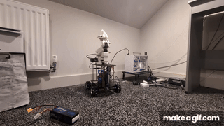
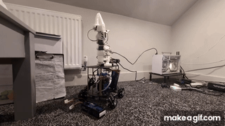

# OmniBot Open

**Hardware kit + teleoperation stack for a mecanum-wheel mobile-manipulation robot.**

OmniBot Open gives you everything you need to build the robot, drive it via Xbox
controller or Android app, and collect high-quality teleoperation demonstrations
for imitation learning — no cloud dependency, no subscription, no AI required.

<p align="center">
  
  
</p>

<p align="center">
  
  
</p>

<p align="center">
  <a href="https://www.youtube.com/@varun.vaidhiya/videos">
    
  </a>
  &nbsp;
  <a href="https://x.com/varunvaidhiya">
    
  </a>
  &nbsp;
  
  &nbsp;
  
</p>

---

## Follow for Updates

This project is actively developed. For regular updates on new features,
hardware builds, and demo videos:

- **YouTube**: [youtube.com/@varun.vaidhiya](https://www.youtube.com/@varun.vaidhiya/videos) — build logs, demo videos, teleoperation walkthroughs
- **X / Twitter**: [@varunvaidhiya](https://x.com/varunvaidhiya) — progress updates, behind-the-scenes, early previews

---

## OmniBot Full (coming soon)

> **A full closed-source version of OmniBot is in development and will be
> released soon** by the creator, with a monetization model that keeps the
> project sustainable and self-funded.

The full version will include everything in OmniBot Open, plus:

- **Autonomous navigation** — Nav2 + SLAM + EKF sensor fusion
- **Visual Language Action models** — OpenVLA and SmolVLA inference nodes for
  robot manipulation policies trained from the teleoperation data you collect here
- **Reinforcement learning** — Isaac Lab sim-to-real RL for navigation and arm control
- **AI orchestration** — natural language mission planning via Claude + LangGraph
- **Gazebo + Isaac Sim digital twin** — full simulation environment for contributors
  without hardware
- **Extended Android app** — AI chat, SLAM map viewer, 3D point cloud, autonomous
  mission control

**All teleoperation demos, Android app walkthroughs, and data collection demos
will be released alongside the full version** on [YouTube](https://www.youtube.com/@varun.vaidhiya/videos).

Watch this repo and follow on [X](https://x.com/varunvaidhiya) for updates.

---

## What's Included in OmniBot Open

| Area | Contents |
|---|---|
| **Hardware description** | URDF, xacro, STL meshes — full assembly reference |
| **Yahboom base driver** | Serial driver for the Yahboom expansion board (`omnibot_driver`) |
| **SO-101 arm driver** | 6-DOF arm via LeRobot FeetechMotorsBus (`omnibot_arm`) |
| **Xbox teleoperation** | Joy node + teleop_twist_joy, configurable button mapping |
| **Android app** | Kotlin MVVM app — virtual joystick, arm sliders, camera feeds, emergency stop |
| **VR teleoperation** | Placeholder package (`omnibot_vr_teleop`) — contribution welcome |
| **LeRobot data recording** | Leader-follower imitation data collection (`teleop_recorder_node`) |
| **BEV stitcher** | 4-camera bird's-eye-view for overhead data collection |
| **Yahboom protocol library** | Pure-Python encoder/decoder (`packages/yahboom_ros2`) |
| **Mecanum kinematics** | C++17 + Python kinematics library (`packages/mecanum_drive_ros2`) |

## What's NOT Included (OmniBot Full)

- Autonomous navigation (Nav2, SLAM, EKF)
- VLA / AI inference (OpenVLA, SmolVLA)
- Reinforcement learning (Isaac Lab, ONNX policies)
- AI orchestration (LangGraph, Claude)
- Gazebo / Isaac Sim digital twin

---

## Demos

> Full video demos are being recorded and will be published on
> [YouTube](https://www.youtube.com/@varun.vaidhiya/videos) when OmniBot Full
> launches. The sections below describe exactly what each demo will show.

### Xbox Teleoperation Demo
- Driving the mecanum base in all four directions and rotating in place
- Turbo mode (2× speed) via RT trigger
- Simultaneous base + arm control — driving while operating the SO-101 arm
- Emergency stop and safe recovery

### Android App Demo
- Connecting to the robot over Wi-Fi via ROSBridge (`ws://robot-ip:9090`)
- Live MJPEG camera feeds — front view + wrist camera
- Virtual joystick for base control
- Arm joint sliders — all 6 DOF with live joint state feedback
- Emergency stop button
- Connection status indicator + automatic reconnect

### LeRobot Data Collection Demo
- Setting up the leader-follower arm configuration (SO-101 teleop)
- Recording an episode — pick up an object and place it
- Discarding a bad episode and re-recording
- Browsing the saved dataset (Parquet + MP4 format)
- Uploading to HuggingFace Hub with `lerobot` CLI

### BEV Camera Demo
- All four base cameras stitching into a single 800×800 bird's-eye-view image
- Real-time BEV feed in the Android app and Foxglove browser viewer

---

## Hardware BOM

> **TODO**: Add a full Bill of Materials with links and approximate costs.

Key components:
- Yahboom ROS Robot Expansion Board (mecanum drive, USB serial)
- 4× mecanum wheels (40 mm radius)
- Raspberry Pi 5 (8 GB) — robot brain
- SO-101 6-DOF arm with 7× Feetech STS3215 servos (LeRobot compatible)
- 5× USB cameras (4 base-mounted + 1 wrist)
- Orbbec Astra Pro RGB-D camera (optional — depth + 3D point cloud)
- Xbox controller (for teleoperation)
- USB hub + power management

See `robot_ws/src/omnibot_description/urdf/omnibot.urdf.xacro` for link
dimensions and joint placements.

---

## Assembly Guide

> **TODO**: Add step-by-step hardware assembly instructions with photos.

Reference the URDF at `robot_ws/src/omnibot_description/urdf/omnibot.urdf.xacro`
for link geometry and joint limits. The firmware package
(`robot_ws/src/omnibot_firmware/`) contains legacy STM32 notes — the active
motor board is the Yahboom expansion board via USB serial (`/dev/ttyUSB0`).

---

## Quick Start

### 1. Prerequisites

- Ubuntu 24.04 + ROS 2 Jazzy on the robot (Raspberry Pi 5 or workstation)
- Python 3.10+
- `lerobot` installed for data collection: `pip install lerobot`

### 2. Build

```bash
git clone https://github.com/varunvaidhiya/OmniBot-Open
cd OmniBot-Open

source /opt/ros/jazzy/setup.bash
cd robot_ws
rosdep install --from-paths src --ignore-src -y
colcon build --symlink-install
source install/setup.bash
```

### 3. Configure deployment

```bash
cp deployment.env.example deployment.env
# Edit deployment.env: set YAHBOOM_PORT, robot IP, etc.

python deploy.py              # interactive menu
python deploy.py --mode single  # non-interactive single-machine
```

### 4. Launch: Xbox teleoperation

```bash
# Robot driver + Xbox controller (all-in-one)
ros2 launch omnibot_bringup robot_with_joy.launch.py

# Or use the convenience script (sources network.env for multi-machine DDS):
./launch_teleop.sh
```

Xbox controls (see `robot_ws/src/omnibot_bringup/config/xbox_teleop.yaml`):

| Input | Action |
|---|---|
| Hold **RB** | Enable driving |
| Hold **RT** | Turbo (2× speed) |
| **Left stick** | Linear X / Y (strafe) |
| **Right stick** | Rotate (angular Z) |

### 5. Launch: Android app

```bash
# Start ROSBridge WebSocket server (port 9090)
./launch_rosbridge.sh
# Or directly:
ros2 launch rosbridge_server rosbridge_websocket_launch.xml port:=9090
```

Open the Android app → Settings → enter your robot's IP address → Connect.

### 6. Launch: Cameras + BEV

```bash
# Start all cameras (run on Pi):
ros2 launch omnibot_bringup perception.launch.py

# View on workstation (set ROS_DOMAIN_ID=30 first):
ros2 launch omnibot_bringup perception_viewer.launch.py
```

---

## Data Collection

Use `teleop_recorder_node` to record leader-follower demonstrations in
[LeRobot HuggingFace dataset format](https://github.com/huggingface/lerobot)
(Parquet + MP4).

```bash
# 1. Start cameras and BEV stitcher
ros2 launch omnibot_bringup perception.launch.py

# 2. Start arm driver (follower arm on /dev/ttyACM0, leader on /dev/ttyACM1)
ros2 launch omnibot_arm arm.launch.py

# 3. Start the recorder
ros2 launch omnibot_lerobot teleop_record.launch.py
```

**Xbox controller recording controls:**

| Button | Action |
|---|---|
| **RB** | Start / stop recording an episode |
| **LB** | Discard current episode |

Episodes auto-save after the timeout or when RB is released. Each episode
captures joint states, BEV image, wrist image, and base odometry at 30 Hz.

**Key parameters** (`robot_ws/src/omnibot_lerobot/config/smolvla_params.yaml`):

| Parameter | Default | Description |
|---|---|---|
| `output_dir` | `~/datasets/mobile_manipulation` | Where episodes are saved |
| `repo_id` | `local/mobile_manipulation` | LeRobot dataset repo ID |
| `record_hz` | `30.0` Hz | Recording frequency |
| `episode_timeout_s` | `60.0` s | Max episode length |

To push your dataset to HuggingFace Hub after recording:

```bash
huggingface-cli login
python -c "
from lerobot.common.datasets.push_dataset_to_hub import push_dataset_to_hub
push_dataset_to_hub('~/datasets/mobile_manipulation', 'your-hf-username/omnibot-demos')
"
```

---

## Android App

The Android app provides full manual teleoperation, arm joint control, live
camera feeds, and emergency stop — all over Wi-Fi via ROSBridge WebSocket.

**Connection**: `ws://<robot-ip>:9090`  
**Default robot IP**: `192.168.1.100` — change in Settings.

### Features

| Feature | Description |
|---|---|
| **Virtual joystick** | On-screen joystick → `/cmd_vel/teleop` at 20 Hz |
| **Arm control** | 6 sliders, one per joint → `/arm/joint_commands` |
| **Camera feed** | Live MJPEG streams (front + wrist) via `web_video_server` |
| **Emergency stop** | Instantly zeros all velocity; hold to clear |
| **Status indicators** | Connection state, battery, IMU heading |
| **Control mode** | App sets `/control_mode = "teleop"` before driving |

Joint names the app uses (must match the arm driver):
```
arm_shoulder_pan  arm_shoulder_lift  arm_elbow_flex
arm_wrist_flex    arm_wrist_roll     arm_gripper
```

ROSBridge reconnect: up to 5 attempts, exponential back-off starting at 1 s.

---

## VR Teleoperation

VR teleoperation is a **placeholder** — no implementation exists yet.

The `robot_ws/src/omnibot_vr_teleop/` package contains a README describing
the expected interface:
- **Subscribe**: `/camera/front/image_raw`, `/camera/wrist/image_raw`
- **Publish**: `/cmd_vel/teleop` (`geometry_msgs/Twist`), `/arm/joint_commands` (`sensor_msgs/JointState`)

A WebXR + ROSBridge approach is recommended. Contributions very welcome — see
[CONTRIBUTING.md](CONTRIBUTING.md).

---

## Multi-Machine Networking

Edit `network.env` with your machine IPs before running cross-machine:

```bash
WORKSTATION_IP=192.168.1.100   # desktop / data collection PC
PI_IP=192.168.1.101            # Raspberry Pi 5 running ROS
```

`launch_teleop.sh` sources this file and sets `ROS_STATIC_PEERS` automatically.
`ROS_DOMAIN_ID=30` must match on all machines.

---

## Contributing

Contributions are especially welcome for:

- **Hardware docs**: assembly photos, BOM with links and costs, CAD files
- **VR teleoperation**: implement `omnibot_vr_teleop` (see its README)
- **New teleoperation methods**: phone browser, web UI, SpaceMouse
- **Camera calibration**: intrinsics + extrinsics for BEV stitcher
- **Tests**: driver unit tests, kinematics edge cases

Please open an issue before starting large features.

---

## License

Apache 2.0 — see [LICENSE](LICENSE).

Copyright 2024 OmniBot Contributors.
