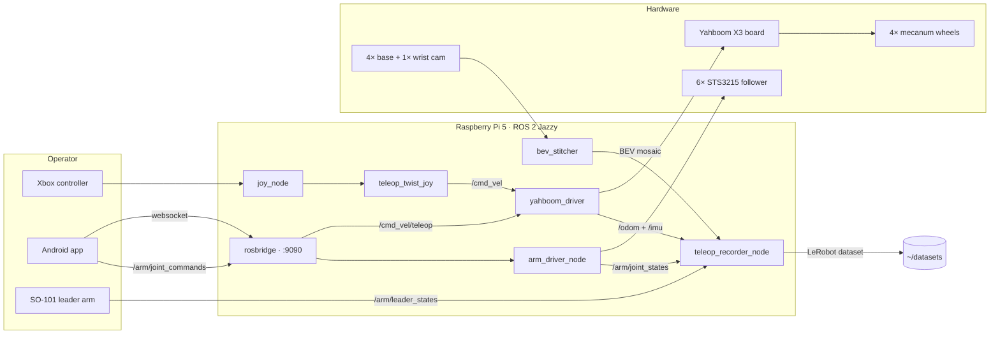

# Building OmniBot from parts: Raspberry Pi 5, ROS 2, and a mecanum mobile manipulator — from a box of servos to imitation-learning data

OmniBot Open is a **development platform, not a closed consumer robot**. It is a
mecanum-wheel mobile base carrying a 6-DOF SO-101 arm, driven by a Raspberry Pi 5
running ROS 2 Jazzy, with everything you need to drive it by hand and collect
high-quality teleoperation demonstrations for imitation learning — no cloud, no
subscription, no AI required.

This guide walks the full reproduction path the way you would actually build it:
mechanical assembly first, then compute, then one subsystem at a time, each with a
**success criterion you can check before moving on**. The order is deliberate.
Robotics bring-up is a layered validation problem, not a parts list — a mistake at
the wheel-direction layer is invisible until you are three layers up wondering why
odometry drifts. Validate low, then climb.

If you only skim one thing: **do not wait until you are recording a dataset to
discover which servo is which.** Servo identity, home position, and joint
direction are decided at Stage 4 and everything above depends on them.

---

## Target specifications

| Property | Value |
|---|---|
| Drivetrain | 4× mecanum wheels, holonomic (drive + strafe + rotate) |
| Wheel radius / track / wheelbase | 0.04 m / 0.215 m / 0.165 m |
| Manipulator | SO-101, 6-DOF, 7× Feetech STS3215 serial-bus servos |
| Compute | Raspberry Pi 5 (8 GB), Ubuntu 24.04, ROS 2 Jazzy |
| Motor controller | Yahboom Rosmaster X3 expansion board (USB serial + IMU) |
| Perception | 4× base cameras → bird's-eye-view mosaic, 1× wrist camera |
| Teleoperation | Xbox controller, Android app (ROSBridge), optional leader arm |
| Output | LeRobot / HuggingFace datasets (Parquet + MP4) at 30 Hz |

## The four validation layers

Every stage below belongs to one of four layers. You should not proceed to a
higher layer until the layer beneath it passes its check.

| Layer | Question it answers | Passes when… |
|---|---|---|
| **L1 — Hardware bring-up** | Is it wired and powered safely? | E-stop cuts motor power; nothing gets hot; USB devices enumerate |
| **L2 — Actuator config** | Does each joint/wheel have an identity and a sign? | Servos have unique IDs; wheels spin the correct way; odometry is sane |
| **L3 — Manual control** | Can a human drive every DOF? | Xbox + app move base and arm; e-stop works from software too |
| **L4 — Data / autonomy** | Can it produce useful data? | A recorded episode replays and pushes to the Hub |

---

## Hardware module breakdown

| Module | Package / file | Reproduction focus |
|---|---|---|
| Mecanum base driver | `packages/yahboom_ros2` | Serial protocol, `/cmd_vel` → motion, `/odom` + IMU |
| Kinematics | `packages/mecanum_drive_ros2` | Body-twist ↔ wheel-speed math, pose integration |
| Arm driver | `robot_ws/src/omnibot_arm` | Feetech bus, tick↔radian, joint limits, torque enable |
| Servo bring-up | `omnibot_arm/scripts/configure_servos.py` | ID assignment, home capture, direction check |
| Xbox teleop | `omnibot_bringup/config/xbox_teleop.yaml` | Deadman switch, turbo, axis mapping |
| BEV stitcher | `packages/ros2_bev_stitcher` | Homography calibration, multi-cam fusion |
| Data recorder | `robot_ws/src/omnibot_lerobot` | 9-D state/action, episode state machine |
| Android app | `android_app/` | ROSBridge WebSocket, virtual joystick, camera feeds |
| Deployment | `deploy.py`, `network.env` | Single- vs multi-machine DDS peers |

## System architecture



---

## Stage 1 — Mechanical assembly & power (L1)

**Goal:** a rolling chassis that is safe to energise.

1. Mount the four mecanum motors to the chassis. Mecanum wheels are
   **handed** — the roller diagonals must form an "X" when viewed from above
   (front-left and rear-right rollers point one way; front-right and rear-left
   the other). Getting this wrong makes strafing impossible and is the single
   most common first-build mistake.
2. Fit the Yahboom board, Pi 5 (with its active cooler), and the powered USB hub.
3. Bolt the SO-101 base to the chassis; route the servo bus lead to the hub.
4. Wire power: battery → **main switch → inline fuse → latching e-stop → board**.
   Bring clean 5 V to the Pi through the buck converter on a *separate* rail so a
   motor brownout can't reset the Pi.
5. Sleeve and tie every lead. **Cables must not sit close to rotating joints or
   wheels** — a lead caught in a mecanum roller will strip in seconds.

> ⚠️ **Validate the e-stop before anything else.** With the board powered but
> the Pi commanding zero, press the e-stop and confirm you cannot back-drive the
> motors through the board (they should go dead, not just "commanded stop"). A
> software-only stop is not a safety system.

> 🔩 **Thread-locker** (medium, removable) on every motor-shaft coupler and the
> arm-base fasteners. Vibration from mecanum rollers backs out unsecured screws.

**Success criterion (L1):** the robot rolls freely by hand, the e-stop kills
motor power, and nothing on the power path gets warm at idle.

---

## Stage 2 — Compute bring-up (L1 → L2)

**Goal:** a Pi that builds the workspace and sees every USB device.

```bash
# On the Pi: Ubuntu 24.04 + ROS 2 Jazzy already installed
git clone https://github.com/varunvaidhiya/OmniBot-Open
cd OmniBot-Open

source /opt/ros/jazzy/setup.bash
cd robot_ws
rosdep install --from-paths src --ignore-src -y
colcon build --symlink-install
source install/setup.bash
```

Then confirm device enumeration — this is the boundary between "hardware exists"
and "software can address it":

```bash
dmesg | grep tty
# Expect the Yahboom board on /dev/ttyUSB0
# Expect the Feetech servo bus on /dev/ttyACM0 (and /dev/ttyACM1 if using a leader)
ls -l /dev/ttyUSB0 /dev/ttyACM0
sudo usermod -aG dialout $USER   # log out/in so you can open the ports non-root
```

> 💡 **Pin your ports.** USB enumeration order is not guaranteed across reboots.
> If your board sometimes comes up as `ttyUSB1`, add a `udev` rule keyed on the
> adapter's serial number so it is always `ttyUSB0` — otherwise every config
> file's `serial_port` becomes a lie.

**Success criterion (L2 entry):** `colcon build` is clean and both the board and
the servo bus appear as stable device nodes you can open without `sudo`.

---

## Stage 3 — Base driver bring-up (L2)

**Goal:** the base moves under `/cmd_vel`, and reports odometry and IMU that make
physical sense.

The `yahboom_driver` node speaks the Rosmaster serial protocol (documented in full
in `packages/yahboom_ros2`). It subscribes `/cmd_vel`, ramps velocity to avoid
motor brownouts, and publishes `/odom`, `/imu/data`, and TF. On startup it sends
`SET_CAR_TYPE` five times (50 ms apart) so the board latches into Mecanum-X3 mode.

```bash
ros2 launch omnibot_driver yahboom_base_control.launch.py
# In another terminal, a gentle forward nudge (0.1 m/s for the moment it prints):
ros2 topic pub -1 /cmd_vel geometry_msgs/msg/Twist "{linear: {x: 0.1}}"
```

Now **verify direction and sign** — this is the actuator-config check for the
drivetrain:

| Command | Expected behaviour | If wrong |
|---|---|---|
| `linear.x > 0` | Robot drives **forward** | A wheel is wired reversed |
| `linear.y > 0` | Robot strafes **left** | Mecanum roller handedness is wrong |
| `angular.z > 0` | Robot rotates **CCW** (viewed top-down) | Left/right pair swapped |
| Push robot forward by hand | `/odom` `twist.linear.x` goes **positive** | Encoder sign inverted |

The wheel math lives in `packages/mecanum_drive_ros2` and follows ROS REP-103
(x forward, y left, z CCW):

```
FL = (vx - vy - (L+W)·ω) / r
FR = (vx + vy + (L+W)·ω) / r
BL = (vx + vy - (L+W)·ω) / r
BR = (vx - vy + (L+W)·ω) / r
```

**Success criterion (L2):** all three motions go the right way, and `/odom`
integrates in the correct direction when you push the robot by hand.

---

## Stage 4 — Arm servo configuration (L2)

**Goal:** six servos with unique IDs, a captured home pose, and verified joint
directions. This is the actuator-mapping stage — **decide it once, on purpose.**

Fresh Feetech STS3215 servos all ship with the **same** factory ID, so the arm
driver cannot address them until you assign IDs 1–6. Use the bring-up tool
(`configure_servos.py`, sim-safe if `lerobot` isn't installed):

```bash
# Connect ONE servo at a time; assign it its joint's ID, then move to the next.
ros2 run omnibot_arm configure_servos.py set-id --from 1 --to 1   # shoulder_pan
ros2 run omnibot_arm configure_servos.py set-id --from 1 --to 2   # shoulder_lift
# … repeat through id 6 (gripper). Power-cycle each servo after writing.

# With all six on the bus, confirm they answer:
ros2 run omnibot_arm configure_servos.py scan --port /dev/ttyACM0
```

Fill in the mapping as you go — **do not decide "where each actuator belongs" at
ID-writing time**, decide it here, first:

| Joint | Servo ID | URDF joint name | Home tick | +direction verified |
|---|:---:|---|:---:|:---:|
| Shoulder pan | 1 | `arm_shoulder_pan` | 2048 | ☐ |
| Shoulder lift | 2 | `arm_shoulder_lift` | 2048 | ☐ |
| Elbow flex | 3 | `arm_elbow_flex` | 2048 | ☐ |
| Wrist flex | 4 | `arm_wrist_flex` | 2048 | ☐ |
| Wrist roll | 5 | `arm_wrist_roll` | 2048 | ☐ |
| Gripper | 6 | `arm_gripper` | 2048 | ☐ |

Put the arm in its neutral "zero" pose and capture the home ticks — the tool
prints a block you paste straight into `omnibot_arm/config/arm_params.yaml`:

```bash
ros2 run omnibot_arm configure_servos.py home --port /dev/ttyACM0
```

Then nudge each joint a few ticks to confirm a **positive** command moves the
joint in the **positive** URDF direction (delta is clamped so a typo can't slam a
joint into its stop):

```bash
ros2 run omnibot_arm configure_servos.py jog --id 3 --delta 200
```

Finally bring the driver up and watch it in RViz:

```bash
ros2 launch omnibot_arm arm.launch.py
ros2 topic echo /arm/joint_states     # names must match the URDF exactly
```

> 🧭 **Why names, not just indices, matter.** The driver keys commands by joint
> *name* and clamps to per-joint radian limits (`joint_min`/`joint_max`). If the
> names don't match the URDF, `robot_state_publisher` can't animate the arm and
> your recorded actions won't line up with observations later.

**Success criterion (L2):** `scan` finds six servos, `/arm/joint_states` reads
0 rad at the home pose, and every joint's sign is confirmed.

---

## Stage 5 — Manual teleoperation (L3)

**Goal:** a human can drive every degree of freedom.

```bash
# Base + Xbox controller, all-in-one:
ros2 launch omnibot_bringup robot_with_joy.launch.py
# Or the convenience wrapper (sources network.env for multi-machine DDS):
./launch_teleop.sh
```

The Xbox mapping (`config/xbox_teleop.yaml`) uses a **deadman switch** so the
robot only moves while you are holding the enable button:

| Input | Action |
|---|---|
| Hold **RB** (button 5) | Enable driving (deadman — release = stop) |
| Hold **RT** (button 7) | Turbo (≈2× the default speed cap) |
| **Left stick** | Linear x (forward) / y (strafe) |
| **Right stick** | Angular z (rotate) |

Default caps are intentionally gentle (0.0625 m/s, 0.125 m/s turbo) so first
drives are safe indoors; raise them in the YAML once you trust the build.

For the arm, drive it either from the Android app (Stage 7) or by publishing
`/arm/joint_commands`. The driver actually subscribes `/arm/joint_commands/out`,
and `arm.launch.py` starts an `arm_command_relay` that bridges
`/arm/joint_commands` → `/arm/joint_commands/out` by default. That indirection
exists so the closed OmniBot Full can drop in a command mux (arbitrating VLA and
RL sources) ahead of the driver — launch with `direct_command:=false` to hand the
`/out` topic to that mux instead of the relay.

> 🛑 **Software e-stop, in addition to the hardware one.** Releasing RB zeroes
> `/cmd_vel`, and `/arm/enable = false` cuts servo torque. Test both now, before
> you ever drive near the arm's workspace. The hardware e-stop from Stage 1
> remains the authority; software stops are convenience, not safety.

**Success criterion (L3):** base drives/strafes/rotates on the sticks and stops
the instant RB is released; every arm joint moves and holds; both e-stops work.

---

## Stage 6 — Perception & bird's-eye-view (L3 → L4)

**Goal:** five camera streams, plus a single stitched top-down mosaic of the
robot's surroundings for data collection.

```bash
# On the Pi — bring up all cameras:
ros2 launch omnibot_bringup perception.launch.py
```

The BEV stitcher (`packages/ros2_bev_stitcher`) warps each base camera onto a
shared ground plane via per-camera homographies, alpha-blends the overlaps, and
publishes one unified image. Calibrate once with a flat checkerboard:

```bash
ros2 run ros2_bev_stitcher bev_calibrate \
    --camera-names front rear left right \
    --square-size 0.025 \
    --output ~/bev_calibration.npz
```

Uncalibrated, it falls back to a tiled layout, so you can verify plumbing before
you calibrate geometry. View the result from a workstation:

```bash
ros2 launch omnibot_bringup perception_viewer.launch.py   # set ROS_DOMAIN_ID=30
```

**Success criterion (L4 entry):** the wrist camera streams, and the four base
cameras fuse into one coherent overhead image with the robot roughly centred.

---

## Stage 7 — Android app (L3)

**Goal:** drive the robot and see its cameras from a phone over Wi-Fi.

Start the ROSBridge WebSocket server on the Pi, then connect the app:

```bash
./launch_rosbridge.sh          # or: ros2 launch rosbridge_server rosbridge_websocket_launch.xml port:=9090
```

Open the app → **Settings** → enter the robot's IP → **Connect** (`ws://<ip>:9090`).
The Kotlin/MVVM app provides:

| Feature | Under the hood |
|---|---|
| Virtual joystick | `/cmd_vel/teleop` at 20 Hz |
| Arm sliders (6 DOF) | `/arm/joint_commands`, live `/arm/joint_states` feedback |
| Camera feeds | MJPEG (front + wrist) via `web_video_server` |
| Emergency stop | Instantly zeros velocity; hold to clear |
| Auto-reconnect | Up to 5 attempts, exponential back-off from 1 s |

**Success criterion (L3):** the phone drives the base, the arm sliders move the
follower, both camera feeds render, and the app reconnects after a Wi-Fi blip.

---

## Stage 8 — Imitation-learning data collection (L4)

**Goal:** record synchronized arm + base demonstrations in LeRobot dataset format
— the payoff the whole stack was built for.

With a **leader** SO-101 arm you demonstrate by moving the leader (the follower
mirrors it) while driving the base with the Xbox controller:

```bash
ros2 launch omnibot_bringup perception.launch.py     # cameras + BEV
ros2 launch omnibot_arm arm.launch.py                # follower + leader
ros2 launch omnibot_lerobot teleop_record.launch.py  # the recorder
```

The recorder captures a **unified 9-D state and action** at 30 Hz:
`[arm(6), base_vx, base_vy, base_vz]`, plus the wrist image and the BEV mosaic,
into a simple episode state machine:

| Button | Action |
|---|---|
| **RB** | Start / stop recording an episode |
| **LB** | Discard the current episode |

Episodes auto-save on timeout (`episode_timeout_s`, default 60 s). Data lands in
`~/datasets/mobile_manipulation` — as LeRobot Parquet + MP4 if `lerobot` is
installed, or a compressed `.npz` fallback if not, so a laptop without LeRobot
can still capture. Push to the Hub when you're happy:

```bash
huggingface-cli login
python -c "
from lerobot.common.datasets.push_dataset_to_hub import push_dataset_to_hub
push_dataset_to_hub('~/datasets/mobile_manipulation', 'your-hf-username/omnibot-demos')
"
```

> 🎯 **Record slow, record clean.** The recorder caps base speed to 0.2 m/s
> during capture on purpose. Demonstrations with smooth, deliberate motion train
> far better policies than fast, jerky ones — and one clearly-labelled episode
> beats ten ambiguous ones. Use **LB** liberally.

**Success criterion (L4):** a recorded episode reloads with matching state/action
lengths and non-black images, and pushes to the Hub without error.

---

## Debugging reference

| Symptom | Most likely layer | First thing to check |
|---|---|---|
| Robot won't move on `/cmd_vel` | L2 | Is `yahboom_driver` up? Right `serial_port`? `SET_CAR_TYPE` sent? |
| Strafe doesn't work, forward does | L1 | Mecanum roller handedness / wheel positions |
| Odometry drifts or points wrong way | L2 | Encoder sign; wheel geometry params vs the real robot |
| Only one arm joint responds | L2 | Servo IDs collided — re-run `configure_servos scan` |
| Arm jumps to a wild pose on enable | L2 | `home_ticks` not captured at the true zero pose |
| App connects then drops | L3 | Wi-Fi; ROSBridge on :9090; firewall on the Pi |
| App connects, nothing moves | L3 | `ROS_DOMAIN_ID` mismatch; is the driver on the same machine/peer? |
| BEV is black or garbled | L4 | Calibration `.npz` path; camera indices; lighting |
| Recorded episode is all zeros | L4 | Camera topics not remapped to what the recorder subscribes |
| Pi resets under load | L1 | Motor brownout crossing to the Pi rail — separate the 5 V supply |

---

## Multi-machine deployment

For heavier setups (offboard perception or, later, VLA/RL inference) split the
system across machines. `deploy.py` writes the DDS peer config; all launch
scripts source it:

```bash
python deploy.py                 # interactive: single vs multi
python deploy.py --mode single   # everything on one PC
python deploy.py --show          # print current config
```

`network.env` holds the machine IPs and every machine must share
`ROS_DOMAIN_ID=30`. Single-machine mode leaves DDS on localhost — start there and
only distribute once each subsystem passes its stage check on one box.

---

## What comes next: the road to autonomy

OmniBot Open deliberately stops at "human drives, robot records." That data is the
fuel for the closed **OmniBot Full**, whose horizon mirrors where quadruped and
mobile-manipulation platforms are heading:

- **Autonomous navigation** — Nav2 + SLAM + EKF sensor fusion on the `/odom` and
  IMU streams you validated in Stage 3.
- **Visual-Language-Action policies** — SmolVLA / OpenVLA trained on the exact
  9-D datasets from Stage 8, mux'd into `/arm/joint_commands/out`.
- **Reinforcement learning** — Isaac Lab sim-to-real for base and arm control.

Each of those sits on top of a subsystem you brought up and *validated* here.
That is the point of building bottom-up: reproducing OmniBot Open gives you
end-to-end engineering capability across BOM, wiring, ROS 2, serial protocols,
kinematics, servo calibration, teleoperation, and dataset collection — an
extensible base you can push toward autonomy on your own terms.

---

## Reproduction recommendations

- **Follow the layers in order.** The temptation is to skip to Stage 8. Resist
  it — an unvalidated wheel sign or servo home pose corrupts every dataset you
  record on top of it, silently.
- **Keep the sim fallbacks.** `arm_driver_node`, `configure_servos`, and the
  recorder all run without hardware. Use that to learn the software off-robot.
- **Log your mapping.** Fill in the Stage 4 table and commit it — future-you
  rebuilding after a servo swap will thank present-you.
- **Start slow, indoors, tethered.** Raise the speed caps only after both
  e-stops are proven.

Full BOM: [`docs/BILL_OF_MATERIALS.md`](BILL_OF_MATERIALS.md) ·
Contributing: [`CONTRIBUTING.md`](../CONTRIBUTING.md) ·
Build logs & demos: [YouTube](https://www.youtube.com/@varun.vaidhiya/videos)
